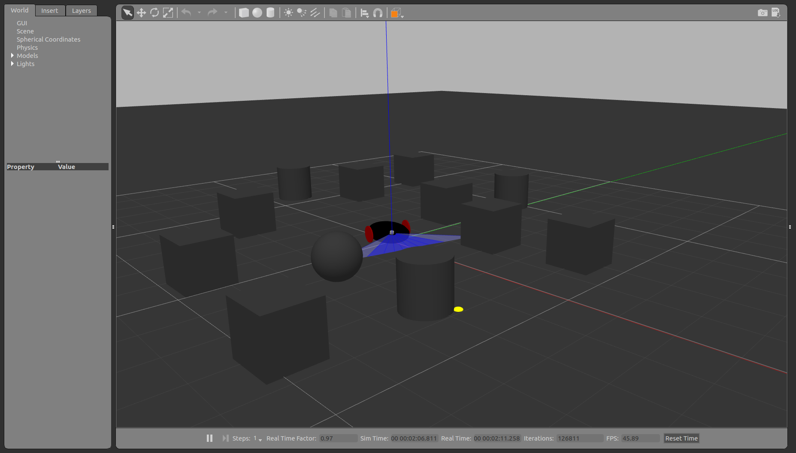

# Obstacle_avoidance-bot-using-ROS-and-GAZEBO
 Simuulation of a urdf differential drive robot in ROS and GAZEBO which avoids obstacles
## Table of Contents
* [About the Project](#about-the-project)
  * [Tech Stack](#tech-stack)
  * [File Structure](#file-structure)
* [Getting Started](#getting-started)
  * [Prerequisites](#prerequisites)
  * [Installation](#installation)
* [Usage](#usage)
* [Results and Demo](#results-and-demo)
* [Future Work](#future-work)
* [Troubleshooting](#troubleshooting)
* [Contributors](#contributors)
* [Acknowledgements and Resources](#acknowledgements-and-resources)
* [License](#license)

## About The Project
  

The aim of the project is used to simulate a two_wheeled robot using ROS and GAZEBO and make it avoid the obstacles by writting a python script.
I have wriiten a urdf for the robot design and basic concepts of path planning are used to avoid obstacles.

### Tech Stack
Software used for this project :  
  * [ROS](http://wiki.ros.org/kinetic)
  * [GAZEBO](http://wiki.ros.org/gazebo_ros_pkgs)
   
## Getting Started

### Prerequisites
  * ROS(Kinetic)
  * GAZEBO(7)
  

### Installation
1. Clone the repo
2. Run catkin_make 
3. Launch your terminal and run the command roslaunch worlds <world_name>.launch. This will launch the gazebo enviroment
4. In another terminal, run the command roslaunch bot_description spawn.launch. This will load the robot in the environment at origin. It can be spawned at different location by giving additional arguments like x:=3 y:=8 z:=7.
5. In another terminal run rosrun path_planning obstacle_avoidance.py. This will start the robot and obstacle avoidance algorithm

### Troubleshooting 
1. Check the required versions of the software are correctly installed as it gives a lot of errors which doesn't mention this problem.
2. Check the identation while writing codes
3. Use proper package path and model name for launch files

### Results and Demo

[**Video of Final Scene**](https://youtu.be/0w1SfuEGP0o)  

## Contributors
 * MENTOR
   * NEHA KURIAN:
 * MEMBER
   * [Ms. Tejal Bedmutha](https://github.com/Tejal-19) : tezzb18@gmail.com
  
## Acknowledgements and Resources
* [SRA VJTI](http://sra.vjti.info/)   
* [ROS Tutorials](https://youtu.be/PyC4Vj3NUUY)
* [ROS Tutorials](https://www.theconstructsim.com/ros-projects-exploring-ros-using-2-wheeled-robot-part-1/)

## License
  MIT License  
  
  Copyright (c) 2020 Tejal Bedmutha.
  Go to [License](LICENSE) for full license. 
 
 

